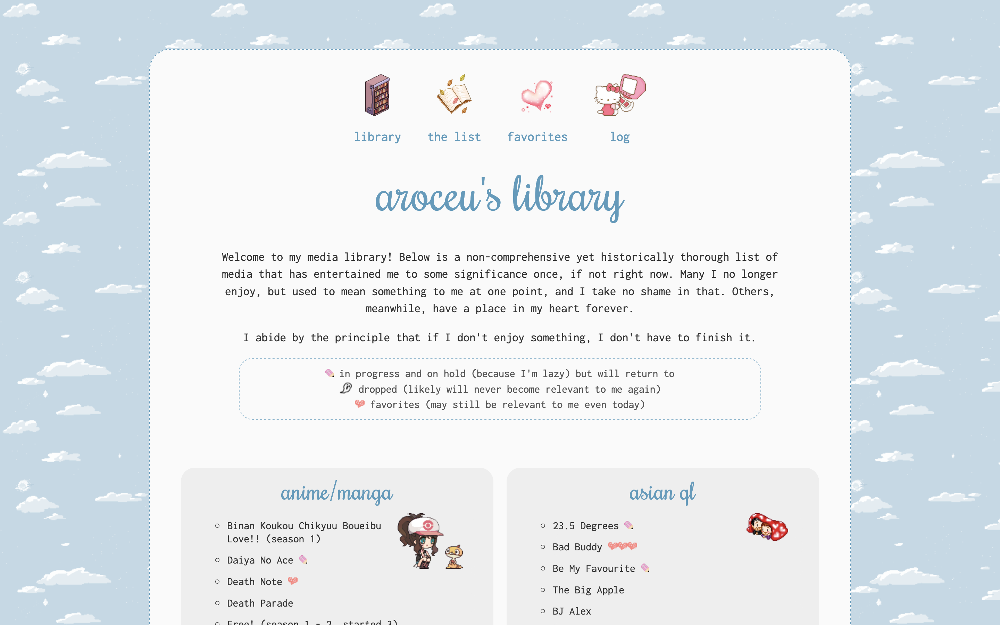
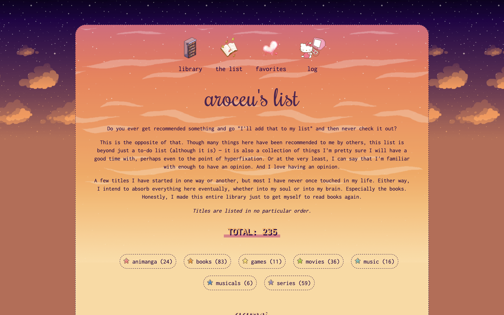
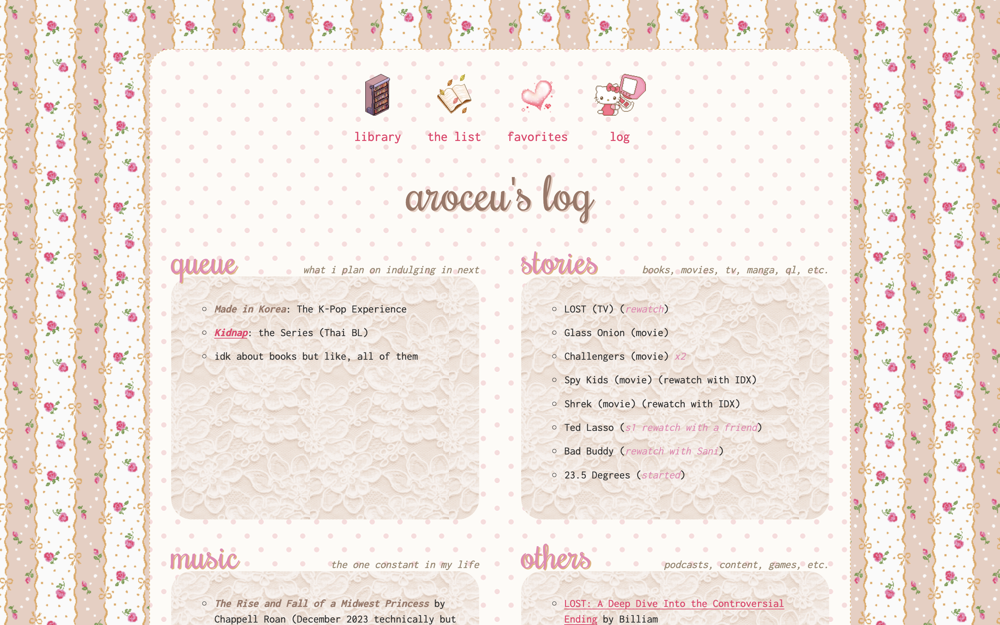

# aroceu's library

A small archive of media that I have enjoyed or that has impacted me to some degree; an image-based list of media that I would like to get into; my favorites in media; and a current day log of the things that have recently brought me joy. 

This is an alternative to having a listed "fandoms" page, as there are many things that I like, and more specific themes/characters/ships that I like are important to me. At the same time, I want this portion of my website to be easily navigable, and not overload too much information to visitors at the same time. Though the lists on each page are quite large, I feel that separating them categorically like this is representative of how I feel about my enjoyment (or lack thereof) of media entertainment.

Additionally, this section provides links to my Letterboxd and Last.fm accounts, though they are not linked from my direct contact page. This makes it easier for my specific interests in movies or music to be coalesced and more easily accessible from one page.

### features

- Pixel graphics (decorative)
- Collapsible overflow boxes via Javascript
- Collapsible image-based to-do list
- Custom icons to indicate my relationship with certain items
- Background images

## pages
- Home (library)
- The List (to-do)
- Favorites (themes, things, characters, ships)
- Log (regularly updated log of my media interests for the current year as well as a queue; once the year passes, this will contain an archive of past years' logs as well)

# changelog

### 23 October 2024

This one's up too! I'll also be pushing updates through here.

# gallery

# archive

As I have moved the idea of my "clubhouse" to kingdra.net, the clubhouse portion of my library is no longer active. 

